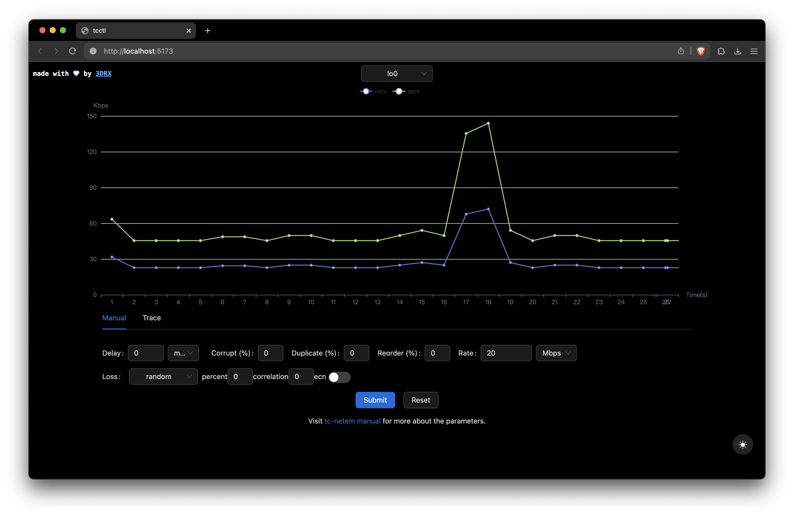

# tcctl



> A webui for tc netem.

## Features

- [x] Visualize network interface traffic status
- [x] Dark mode
- [x] Apply network shaping rules manually & automatically by trace file
    - [x] Control delay, packet loss rate, bandwidth
    - [x] Run as deamon
    - [ ] Configure packet loss distribution
    - [ ] Filter by IP and port
- [ ] Record current network condition to a trace file

## Quick Start

> The following operations should be taken as root user

```
opkg update
opkg install tc-full
```

Install dependencies, restart, decompress the zip (download available in release) and put it at /root/tcctl (IMPORTANT),
cd into it and run `chmod +x install.sh && install.sh`, which will add `/etc/init.d/tcctl` start and enable it by default.
Then go to `http://<host_name_of_your_router>:8080`.

## Documentation

[Full Documentation](https://www.3drx.top/blog/gadgets/tcctl)
