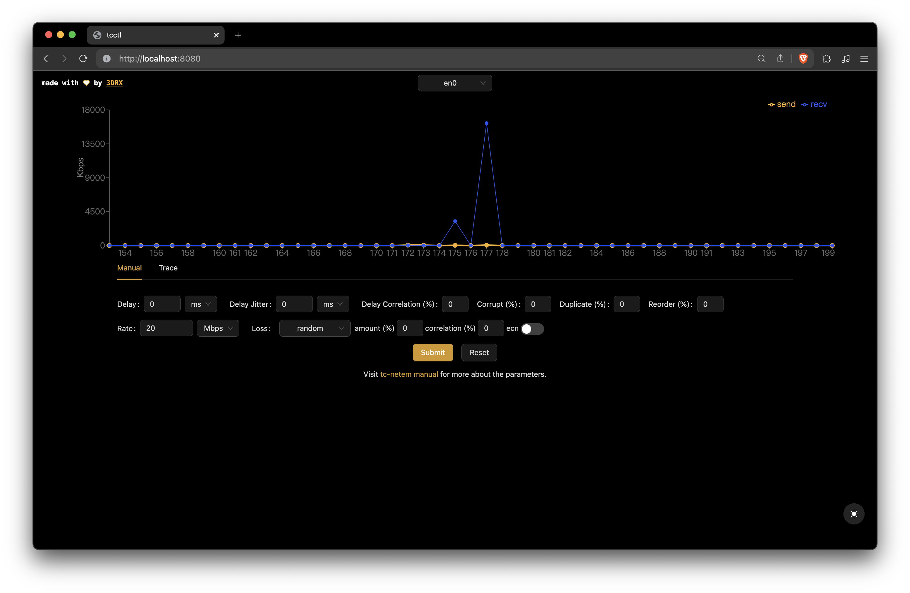
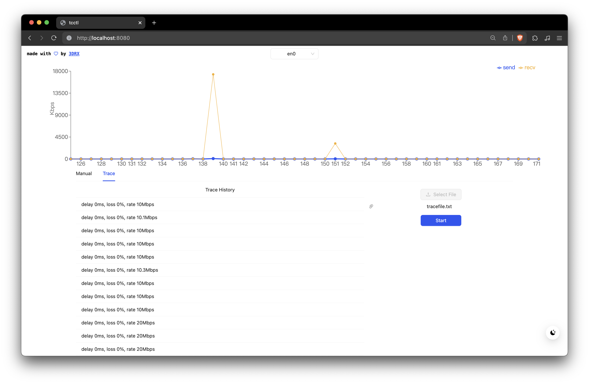

## Features

1. Starts automatically in background when system boots.
2. Monitor network traffic by interface.
3. Apply limitations on **delay**, **corrupt**, **duplicate**, **reorder**, **packet loss**,
and **data rate** via netem.
4. Upload [trace file](#trace-file-mode) and apply limitations according to the trace.
5. Switching between manual mode and trace file mode will reset all shaping rules.
6. It is recommended to connect to tcctl from a port that's not been controlled by itself.

### Manual Mode



Set network shaping parameters by **integer**.
Click "Submit" to apply the values, if submit multiple times,
subsequent submissions will override previous ones.
Click "Reset" button to clear all shaping rules to network interface.

### Trace File Mode



Set delay(ms), loss(%), rate(Mbps) by **floating point number**.
Select a NIC before upload trace file, click "Start" button to start playback the network trace.

For example

```
10 1 20
10 1 20
10 1 20
10 1 20
```

describes a trace that have 10 ms delay, 1% packet loss,
and 20 Mbps data rate for 4 seconds (each line represents 1 second).
There shouldn't be blank line in trace file.
