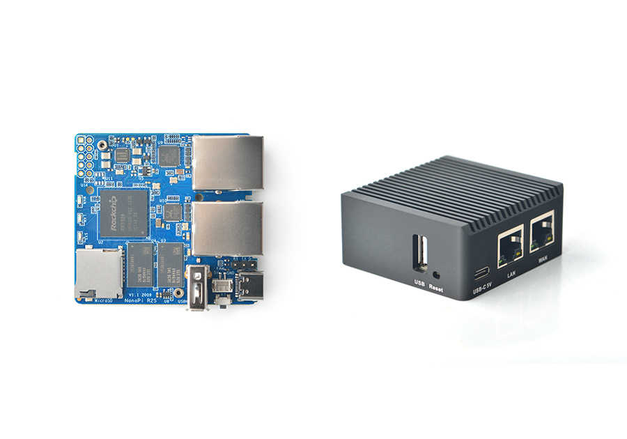

Tcctl 可以在任何安装了 `tc` 命令并支持 netem 的 Linux 系统上运行。
本教程将指导您如何在 NanoPi R2S 等硬件上设置 OpenWrt。

## 前提条件

1. 你的 Pi
2. 用于在 Pi 上安装固件的 SD 卡
3. 连接到计算机的 SD 卡读卡器

## 步骤

1. 在此查找适合您设备的 OpenWrt 固件：https://firmware-selector.openwrt.org/。
2. 将固件闪存到 SD 卡，例如，您可以使用 [balenaEtcher](https://github.com/balena-io/etcher)。
3. 插入卡片，开启机器。如果要将固件刷入 eMMC，请遵循硬件厂商的说明。
4. 测试网络连接。
